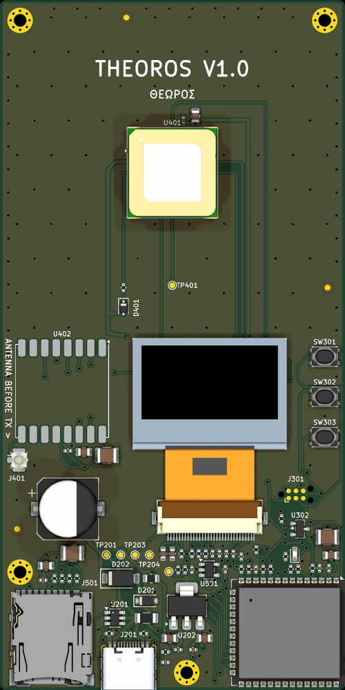
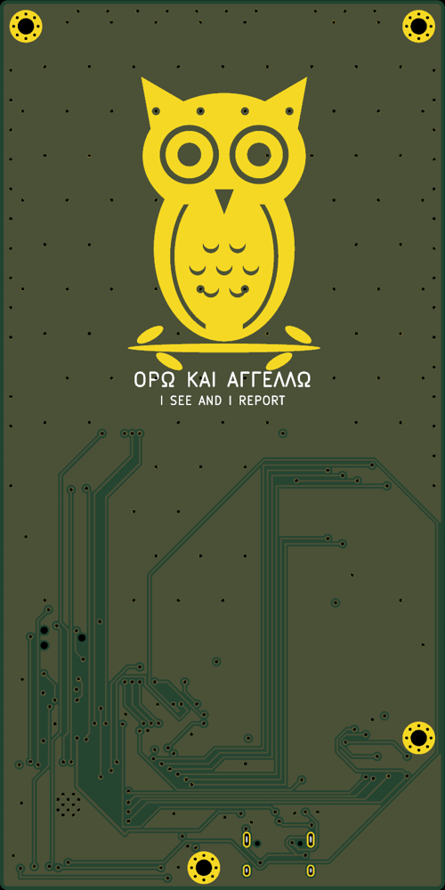
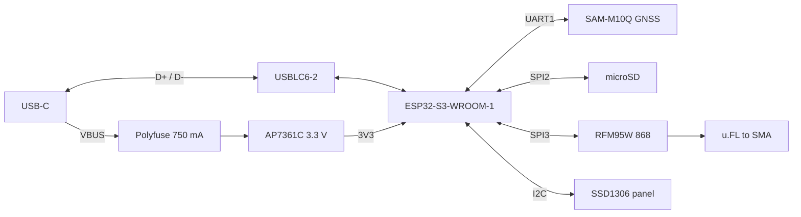

# Theoros

*Theoros* (Greek θεωρός): an official observer and envoy, sent to watch
and report back.

USB-powered GPS logger with LoRa telemetry, built around the ESP32-S3.

Logs GPS fixes to a microSD card at 1 Hz, shows status on an OLED, and sends
position over 866 MHz LoRa. WiFi provides NTP time, log download and OTA
updates. Designed in KiCad as a 4-layer, fully machine-assembled board
(Lion Circuits PCBA, Bangalore, single-sided).

> **Status: V1.0 design complete** (schematic, routed PCB, fab outputs and
> firmware). Not yet fabricated or tested. Do not order boards from this
> repository until a tagged release exists.

  
  

## Features

- ESP32-S3-WROOM-1-N8 with native USB (no USB-UART bridge)
- USB-C power and data, 5 V 1 A
- u-blox SAM-M10Q GNSS module with integrated antenna, UART and PPS
- microSD logging on a dedicated SPI bus
- RFM95W (SX1276) 868 MHz-band LoRa radio on a second SPI bus, u.FL antenna
- Telemetry and SD logs encrypted and authenticated (AES-128-CCM, per-tracker
  keys); separate tracker and receiver firmware
- Bare SSD1306 128x64 OLED panel on I2C, FPC connector
- Low-dropout 3.3 V linear regulator (AP7361C)
- Tag-Connect footprint for UART0 console, EN and GPIO0
- 4-layer stackup with solid ground plane and impedance-controlled RF and USB traces

## Block diagram

## Repository layout

| Path | Contents |
|---|---|
| `hardware/` | KiCad 10 project (schematic, PCB) |
| `hardware/lib/` | Project-local symbols, footprints and 3D models |
| `docs/` | Design and security specifications (Markdown and PDF), images |
| `firmware/` | ESP32-S3 firmware (Arduino, untested on hardware) |
| `production/` | Fabrication outputs (Gerbers, drill, BOM, CPL) per release |

## Documentation

- [PCB design specification](docs/PCB_DESIGN.md): pin assignment, power
  budget, layout rules and design decisions.
- [Firmware](firmware/README.md) ([PDF](docs/FIRMWARE.pdf)): tracker and
  receiver firmware, build, console, WiFi service mode, OTA, bring-up.
- [Security specification](docs/SECURITY.md) ([PDF](docs/SECURITY.pdf)):
  threat model, AES-128-CCM design, key management, LoRa packet and log
  formats, provisioning, test vectors.

PDFs are generated from the Markdown with `python3 docs/build_pdf.py`.

## Opening the design

Requires [KiCad](https://www.kicad.org/) 10.0 or later. Open
`hardware/theoros.kicad_pro`. All non-standard symbols, footprints and 3D
models are in `hardware/lib/`, so no external libraries are needed.

## Regulatory note

The LoRa radio is configured for 865–867 MHz, India's delicensed band.
Users elsewhere must set the frequency, power and duty cycle allowed in
their region.

## License

Hardware design files are licensed under the
[CERN Open Hardware Licence Version 2 – Permissive](LICENSE)
(CERN-OHL-P-2.0). Firmware (`firmware/`) is licensed under the
[Apache License 2.0](firmware/LICENSE).
